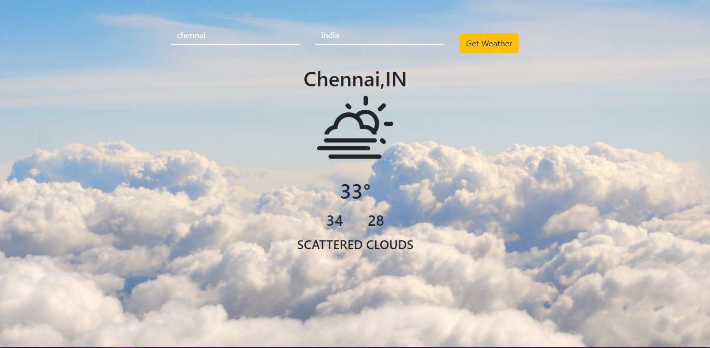

# React Weather

A weather application that displays the current weather based on the entered geolocation data.

Go **[here](https://awesome-boyd-3e2e65.netlify.app)** for live demo.

The weather application is composed of the following components:

* Search-box - Gets City and country input from the user

* CurrentWeatherDisplay - Displays weather information for the entered locatio data in time.

* Min&Max - Displays minimum expected temperature and maximum expected temperature


The following services are used to obtain weather data:

* WeatherService - A wrapper that is responsible for integrating with the [OpenWeather Api]. It provides an interface that allows one to obtain current weather information.


Features:

* Display current weather
* Display minimum expected temperature
* Displays maximum expected temperature
* Displays an Image showcasing the weather condition

This project also demonstrates:

* a typcial React project layout structure
* [OpenWeather API] integration

**Screenshots:**




---

## Developed With

* [Visual Studio Code](https://code.visualstudio.com/) - A source code editor developed by Microsoft for Windows, Linux and macOS. It includes support for debugging, embedded Git control, syntax highlighting, intelligent code completion, snippets, and code refactoring
* [Node.js](https://nodejs.org/en/) - Javascript runtime
* [React](https://reactjs.org/) - A javascript library for building user interfaces
* [Babel](https://babeljs.io/) - A transpiler for javascript
* [Webpack](https://webpack.js.org/) - A module bundler
* [SCSS](http://sass-lang.com/) - A css metalanguage
* [Bootstrap 4](https://getbootstrap.com/) - Bootstrap is an open source toolkit for developing with HTML, CSS, and JS
* [Axios](https://github.com/axios/axios) - Promise based HTTP client for the browser and node.js
* [OpenWeather API] - Provides weather information

---


## Getting Started

These instructions will get you a copy of the project up and running on your local machine for development and testing purposes.

### Prerequisites

The following software is required to be installed on your system:

* Node 8.x
* Npm 3.x

Type the following commands in the terminal to verify your node and npm versions

```bash
node -v
npm -v
```

### Install

Follow the following steps to get development environment running.

* Clone _'weather-App'_ repository from GitHub

  ```bash
  git clone https://github.com/AdityaKumawat97/weather-App
  ```

   _OR USING SSH_

  ```bash
  git clone git@github.com:AdityaKumawat97/weather-App.git
  ```

* Install node modules

   ```bash
   cd weather-App
   npm install
   ```

Before continuing, the following steps are required:

1. Get API keys

   * OpenWeather API

     Have a look at [OpenWeather API](http://openweathermap.org/api)

     Get an API key [here](http://openweathermap.org/appid)


### Build

* Build application

  This command will also run ESLint as part of build process.

  ```bash
  npm run build
  ```

* Build application and start watching for changes

  This command will also run ESLint as part of build process.

  ```bash
  npm run build:watch
  ```

### Run ESlint

* Lint project using ESLint

  ```bash
  npm run lint
  ```

* Lint project using ESLint, and autofix

  ```bash
  npm run lint:fix
  ```

### Run

* Run start

  This will run the _'serve'_ npm task

  ```bash
  npm start
  ```

* Run webpack dev server

  ```bash
  npm run serve:dev
  ```

* Alternatively run live-server (simple development http server with live reload capability)

  ```bash
  npm run serve
  ```

---

## References
https://github.com/akashyap2013/Weather_App
